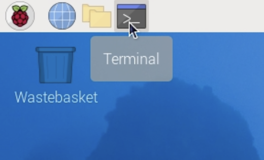

## Find your Activity LED

--- task ---

Open a terminal window from the taskbar.



--- /task ---

You will see a 'prompt'.

--- task ---

Type this command, then press <kbd>Enter</kbd>:

```bash
ls /sys/class/leds/
```

--- /task ---

You should see an entry for `ACT` (the activity LED), or `led0` on older Raspberry Pi models.

--- task ---

Start the Geany editor from the command line. 

```bash
geany blink.sh &
```
This creates a new file named `blink`. 

The extension `.sh` tells Geany that it is a shell script, so Geany can highlight the text in different colours, and knows how to run your script.

The ampersand `&` at the end of the line says that you want to be able to type more commands while Geany is still running ("running in the background"). 

**Note**: You can also open Geany from the main menu. 

--- /task ---

--- task ---

Add these lines to your script:

```bash
#!/bin/bash
for i in {1..3}; do
    echo 1 | sudo tee /sys/class/leds/ACT/brightness
    sleep 0.5
    echo 0 | sudo tee /sys/class/leds/ACT/brightness
    sleep 0.5
done
```

The first line is used to run the script using the Bash language. 

--- /task ---

Set your script to be executable so Raspberry Pi OS can run it as a command.

--- task ---

Return to the terminal window and type this command:

```bash
chmod +x blink.sh
```

`chmod` is short for 'change mode'. 

--- /task ---
